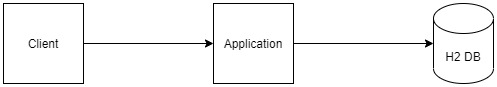

# BITS Open Source Assignment - 4

This repository contains a Spring-Boot project and a Github Pages branch. This project and the README.md and index.md file will be used to indicate contributions of the members by the means of forking, commits and pull requests.


## README file

The README file is often the first file which the users read. It is a text file that contains the information for the user about the software, project, code, game, or it might contain instructions, help, or details about the patches or updates. README File resides in the main branch of this project.

## Github Pages

This page is constructed using the feature Pages provided by Github. This page is built using the branch ```gh-pages``` . The content of the page is placed in the ```index.md``` file while the theme is placed in the ```_config.yml```  file.

## Project Architecture

The project code consists of a Spring Boot Application with an embedded H2 database. The database has insert queries which are executed on application startup. The project architecture is as below




## API Type

GET http://{deploymentIP}:8080/countries

## Responses from the API

### Success Response

```
{
  "meta": {
    "errorCode": "C_000",
    "errorMessage": "Fetching countries successful."
  },
  "data": [
    "USA",
    "France",
    "Brazil",
    "Italy",
    "Canada"
  ]
}
```

### Failure Response

```
{
  "meta": {
    "errorCode": "C_001",
    "errorMessage": "Failure in fetching countries."
  }
}
```